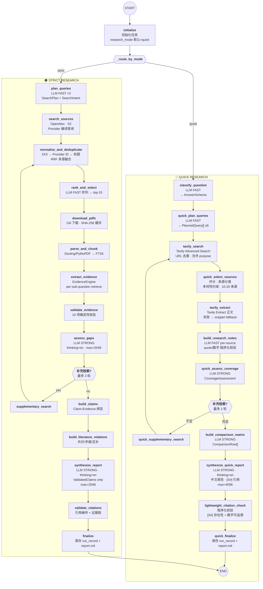

# LangGraph Workflow

## 模式路由

## 数据流对比

| | Quick | Strict |
|---|---|---|
| **问题分析** | AnswerSchema (LLM) | SearchPlan + SearchIntent (LLM ×2) |
| **内容来源** | Tavily 公开网页 + 论文页面 | OpenAlex + Semantic Scholar API |
| **全文获取** | Tavily Extract (网页正文) | PDF 下载 + Docling 解析 |
| **检索** | — | FTS5 + Dense + RRF + CrossEncoder |
| **证据** | ResearchNote (LLM 结构化) | EvidenceCard → ValidatedClaim |
| **中间产物** | ComparisonRow[] | LiteratureRelations + Claims |
| **循环条件** | CoverageAssessment (维度覆盖) | GapAnalysis (证据缺口) |
| **最大轮次** | 2 (QUICK_MAX_SEARCH_ROUNDS) | 3 (MAX_SEARCH_ROUNDS) |
| **报告依赖** | Notes + Matrix + 来源元数据 | ValidatedClaims only |
| **引用格式** | `[S1]` | `[P1]` |
| **质量检查** | 轻量 [S#] 存在性 + 数字可追溯 | 完整引用完整性 + 证据链 |

## 节点分组

| 颜色 | 阶段 | Quick 节点 | Strict 节点 |
|---|---|---|---|
| 🔵 蓝 | 生命周期 | quick_finalize | initialize · finalize |
| 🟠 橙 | 问题分析 | classify_question · quick_plan_queries | plan_queries |
| 🟢 绿 | 搜索获取 | tavily_search · quick_select_sources · tavily_extract | search_sources · normalize · rank |
| 🟣 紫 | 全文/提取 | build_research_notes | download_pdfs · parse_and_chunk · extract_evidence |
| 🔴 粉 | 评估/缺口 | quick_assess_coverage · quick_supplementary_search | validate_evidence · assess_gaps · supplementary_search |
| 🟦 青 | 报告生成 | build_comparison_matrix · synthesize_quick_report | build_claims · build_literature_relations · synthesize_report |
| 🟡 黄 | 质量门 | lightweight_citation_check | validate_citations |

## LLM 调用

### Quick 模式

| 节点 | 模型 | thinking | max_tokens |
|---|---|---|---|
| classify_question | FAST | off | 1024 |
| quick_plan_queries | FAST | off | 1024 |
| build_research_notes (per-source) | FAST | off | 1024 |
| quick_assess_coverage | STRONG | off | 2048 |
| build_comparison_matrix | STRONG | off | 4096 |
| synthesize_quick_report | STRONG | on | 4096 |

### Strict 模式

| 节点 | 模型 | thinking | max_tokens |
|---|---|---|---|
| plan_queries (×2) | FAST | off | 1024 |
| rank_and_select | FAST | off | 1024 |
| assess_gaps | STRONG | on | 2048 |
| synthesize_report | STRONG | on | 2048 |
